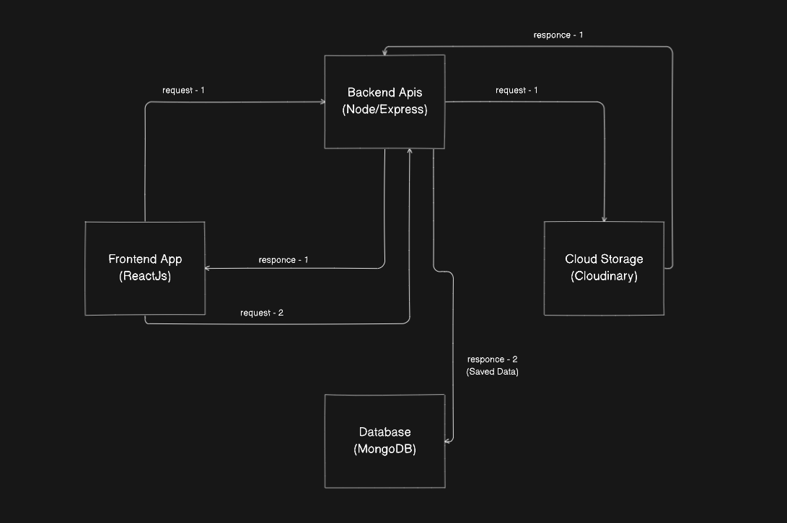
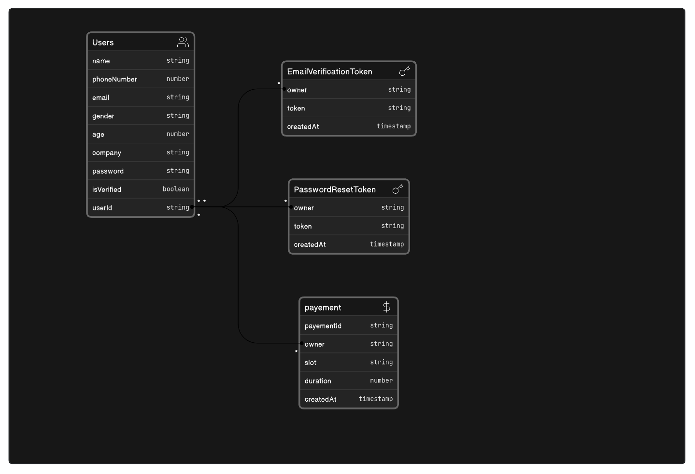

<!-- PROJECT LOGO -->

 NOTE: All Frontend Functionalities will be pushed soon 

 

  
  

  

    <b>Yogavar</b> offers a powerful solution for every facet of your life - from physical wellness to emotional well-being, as well as guidance on living a fulfilling and meaningful life.
     
     
    <a href="https://yogavar.vercel.app/">View Demo</a>
    ·
    <a href="#">Report Bug</a>
    ·
    <a href="#">Request Feature</a>
  

<!-- ABOUT THE PROJECT -->
## About The Project

Here's why you should use yogavar.
* For over 30 years we’ve been leading people like you to the best yoga classes and teachers in the world so you can experience the transformational health benefits of yoga.

* <b>Yogavar</b> offers a powerful solution for every facet of your life - from physical wellness to emotional well-being, as well as guidance on living a fulfilling and meaningful life.

and we are constantly be adding more features in the near future. You may also suggest changes by forking this repo and creating a pull request or opening an issue. 

## Demo shots

  
  
  
  

  
  
  

### Built With

#### Frontend built with
* [Reactjs]() - javaScript Liberary to create UI radipdly 
* [axios]() - just an advanced version of Fetch Api , no need to explictly convert your data into json and many more ..
* [react-icons]() - The icons are from react icon liberary
* [CSS]() - Pure CSS for styling components

#### Backend built with
* [Nodejs]() - javaScript runtime enviroment
* [ExpressJs]() - minimalist web framework for Node.js
* [bcrypt]() - for hashing password and tokens
* [dotenv]() - for hiding sensetive keys and tokens
* [express-async-errors]() - for handling async's exceptions error without using try______and catch mathod. 
* [express-validator]() - for catching errors in terminals
* [jsonwebtoken]() - for session and validation while accesing private routes into the application
* [mongoose]() - MongoDb instances , it makes easy to work with MongoDB data base.
* [morgan]() - HTTP request logger middleware for node.js
* [nodemailer]() - for sending emails and Otp to users.
* [Cloudinary]() - For storing images and video for better optimization
* [multer]() - For handling multi-form data and to upload media file.

### Tools You can use to test the backend Apis
 * [POTMAN]()
 
 ### Routes for users
 
 * [api/user/create]() - for Creating a new user
 * [api/user/signIn]() - for login into the application
 * [api/user/verify-email]() - for verifying the email address using an uique OTP
 * [api/user/resend-email-verificationToken]() - for resending OTP ( restricted for an hour)
 * [api/user//forget-password]() - If you forget your password
 * [api/user/verify-pass-reset-token]() -verify if the reset password token is valid or not
 * [api/user/reset-password]() - for changing password of the user

### Routes for mentors
 
 * [api/mentor/create]() - for Creating a new mentor
 * [api/mentor/update/:mentorId]() - for updating mentor details
 * [api/mentor/:mentorId]() - for delete or searching mentors
 * [api/mentor/search]() - for finding mentors
 * [api/mentor/latest-uploads]() - listing the latest uploaded mentors
 * [api/mentor/single/:id]() - finding a single mentor details

### Routes for courses
 
 * [api/courses/upload]() - for Creating a new courses or to upload a course
 * [api/courses/update/:coursesId]() - for updating courses details
 * [api/courses/:coursesId]() - for delete or searching coursess
 * [api/courses/search]() - for finding coursess
 * [api/courses/latest-uploads]() - listing the latest uploaded coursess
 * [api/courses/single/:id]() - finding a single courses details

## Backend Large-Resources Upload Api Architecture 

  

I have used Youtube video upload design to implement large resources upload feature. The way it works , First the backend will received the data(request-1) from frontend, process it and send it to the cloud storage ( Cloudinary ) then the response (response-1) will be send back to the backend and from there it will reflect on the frontend till then user can fill other detials like title , description and all other things untill the upload process is complete then the frontend will send the data(request-2) back to the backend and it will directly save the data into the database(MongoDB).

## Basic Database Architecture

  

### Database Design [E R Diagram]

  

<!-- GETTING STARTED -->
## Getting Started

Just Fork the repository and make a clone, in your local machine so that you can run it locally and thats it, you are done.

## Contributing

Contributions are what make the open source community such an amazing place to be learn, inspire, and create. Any contributions you make are **greatly appreciated**.

1. Fork the Project
2. Create your Feature Branch (`git checkout -b feature/AmazingFeature`)
3. Commit your Changes (`git commit -m 'Add some AmazingFeature'`)
4. Push to the Branch (`git push origin feature/AmazingFeature`)
5. Open a Pull Request

<!-- LICENSE -->
## License

Distributed under the MIT License. See `LICENSE` for more information.

